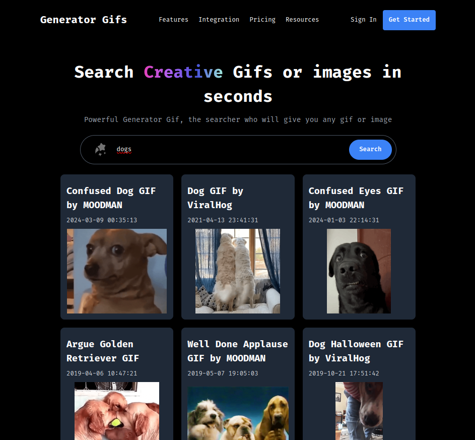

# Buscador de Gifs con Giphy API

Ejemplo de buscador de Gifs utilizando la API de Giphy con React.js

### UI



### :rocket: Puesta en marcha

1.  Necesitamos generar una API Key de Giphy y la copiamos en el fichero `.env.local`. Para ello utilizamos como base el fichero `env-sample`.

2. Instalamos las dependencias del proyecto y lo arrancamos:
```bash
npm install
npm run dev
```

### :hammer: Tecnologías utilizadas

- React.js
- Vite.js
- Tailwind y PostCSS (Estilos)
- Eslint (Linter)
- Giphy API

